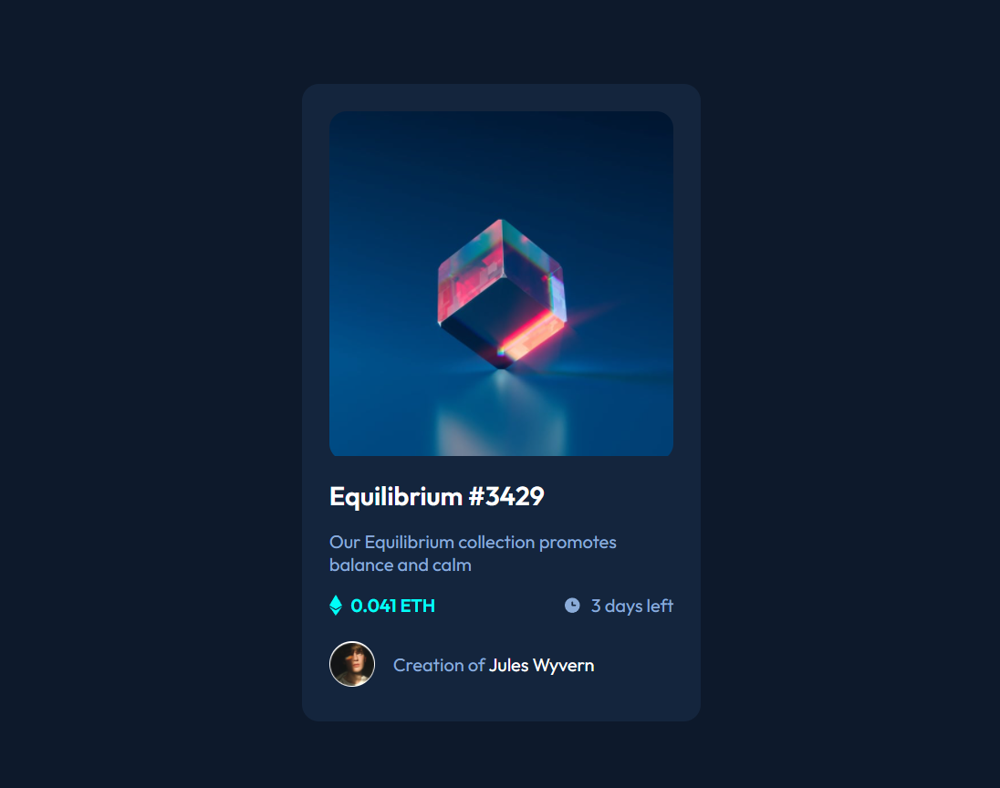

# Frontend Mentor - NFT preview card component solution

This is a solution to the [NFT preview card component challenge on Frontend Mentor](https://www.frontendmentor.io/challenges/nft-preview-card-component-SbdUL_w0U). Frontend Mentor challenges help you improve your coding skills by building realistic projects. 

## Table of contents

    - [Overview](#overview)
  - [The challenge](#the-challenge)
  - [Screenshot](#screenshot)
  - [Links](#links)
    - [My process](#my-process)
  - [Built with](#built-with)
  - [What I learned](#what-i-learned)
  - [Continued development](#continued-development)

## Overview

### The challenge

Users should be able to:

- View the optimal layout depending on their device's screen size
- See hover states for interactive elements

### Screenshot



### Links

- Solution URL: [Add solution URL here](https://github.com/Wardinul/NFT-preview-card-component)
- Live Site URL: [Add live site URL here](https://wardinul.github.io/NFT-preview-card-component/)

## My process

### Built with

- HTML5 
- CSS custom properties
- Flexbox

### What I learned

I learned about the selectors ::before and ::after, wich helped me make the hover effect of the card image. For me that was the hard part in this challenge, to find out how to do that hover effect.

```css
.card-img::before,
.card-img::after {
    content: '';
    position: absolute;
}

.card-img::before {
    top: 0;
    bottom: 0;
    right: 0;
    left: 0;
    background-color: var(--cyan);
    opacity: 0;
}

.card-img::after {
    top: 50%;
    left: 50%;
    transform: translate(-50%, -50%);
    width: 50px;
    aspect-ratio: 1;
    background-image: url('./images/icon-view.svg');
    background-repeat: no-repeat;
    opacity: 0;
}

.card-img:hover::before {
    opacity: .5;
}

.card-img:hover::after {
    opacity: 1;
}
```

### Continued development

I will focus on using the selectors ::before and ::after more often.


